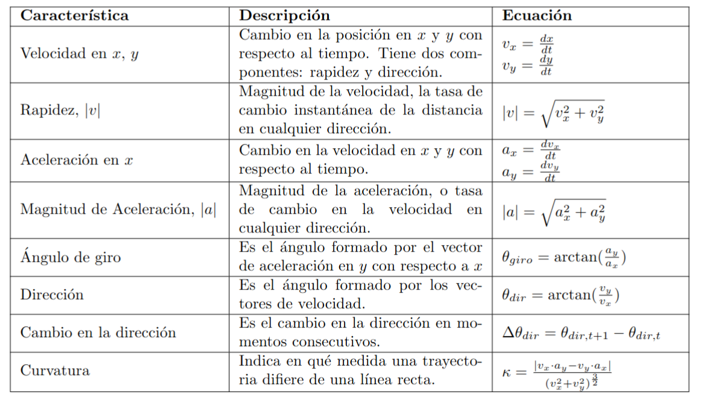

# Segmentación conductual automática de datos espaciales usando modelos ocultos de Markov

>Nota: Proyecto financiado por CONAHCyT a Emmanuel Alcalá (CVU 660431) con una beca de las Estancias Posdoctorales por México para la Formación y Consolidación de las y los Investigadores por México 2022(2).

En este repositorio se muestra cómo realizar segmentación automática usando modelos no supervisados en datos espaciales de ratones moviéndose libremente en una caja de 27x44 cm aproximadamente. Un conjunto de animales estuvo expuesto a ciclohexano como se detalla en [este artículo](https://www.sciencedirect.com/science/article/abs/pii/S0166432821005520).

Los datos espaciales provienen del *software* de estimación de poses [DeepLabCut](http://www.mackenziemathislab.org/deeplabcut). Para este análisis se usó solamente un *keypoint* (la cabeza).

A partir de las coordenadas $\{x_t,y_t\}$ en pixeles, se procesaron las siguientes características:

La [notebook](code/hmm_analysis_v2.ipynb) detalla el proceso de análisis, desde la carga de los datos y el procesamiento de las características hasta la segmentación y visualización de los resultados.